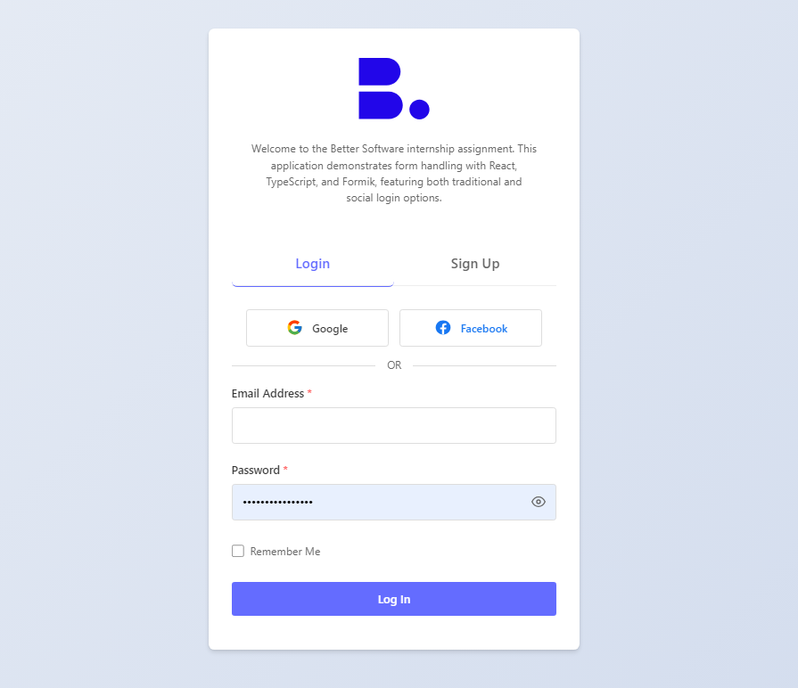

# Better Software Forms

Hi! This is my solution for the Better Software internship assignment. I've built an authentication system that focuses on clean code and great user experience. Using React and TypeScript, I've created form handling that's both user-friendly and developer-friendly, with special attention to validation, accessibility, and modern design practices.

## Live Demo

[Check out the live demo](https://better-software-forms.vercel.app/)



## What's In Here?

**Core Features**

- Smooth login and signup flow
- Smart form validation that guides users
- Clean, lightweight design (no bulky UI frameworks!)
- Type-safe code throughout
- Friendly notification system

**Nice-to-Haves**

- "Remember Me" for returning users
- Visual password strength guide
- Full accessibility support
- Social login options

## Project Structure

Everything's organized like this:

```
├── src/
│   ├── assets/
│   │   └── icons/              # Logos and icons
│   │       ├── better-software-logo.svg
│   │       ├── facebook.svg
│   │       ├── google.svg
│   │       └── favicon.svg
│   ├── components/             # React components
│   │   ├── LoginForm.tsx      # Main login form
│   │   ├── SignupForm.tsx     # Registration form
│   │   ├── PasswordInput.tsx  # Custom password input
│   │   └── Toast.tsx          # Notification component
│   ├── styles/                # All our styles
│   │   ├── App.css
│   │   ├── Layout.css
│   │   ├── Form.css
│   │   ├── PasswordInput.css
│   │   └── Toast.css
│   ├── App.tsx                # Main app component
│   ├── main.tsx
│   └── vite-env.d.ts
│
├── index.html                 # Entry HTML
├── package.json
├── package-lock.json
├── tsconfig.json             # TypeScript config
├── tsconfig.node.json
├── vite.config.ts            # Vite config
├── .gitignore
├── .eslintrc.cjs             # Linting rules
└── README.md
```

## Tools I Used

- React + TypeScript for solid, type-safe code
- Formik for handling form state
- Yup for form validation
- Custom CSS for complete control over the look
- Vite because it's super fast

## Running the Project

You'll need:

- Node.js (v18+)
- npm or yarn

Getting started is easy:

```bash
# Clone it
git clone https://github.com/pascal-azubike/better-software-forms.git
cd better-software-forms

# Install stuff
npm install

# Start it up
npm run dev
```

Check it out at `http://localhost:5173` 🚀

## The Good Stuff

### Forms That Work

- Validation that actually helps users
- Password strength meter that makes sense
- Social login options for quick access
- Fully responsive design

### Code That's Clean

- TypeScript for catching errors early
- Reusable components
- Consistent coding style
- Proper error handling

### Accessibility First

- Works great with screen readers
- Full keyboard support
- Clear visual feedback
- Easy-to-read error messages

### Little Details

- Instant form validation
- Smooth notifications
- Nice animations
- Toggle password visibility

## Current Limitations

Just so you know:

- Frontend only for now
- Uses localStorage for demo purposes
- Simulated form submissions
- Social login is for demonstration

## What's Next?

Some things I'd like to add:

1. Backend integration
2. Better security
3. Real social auth
4. Test coverage
5. Dark mode (because why not?)
6. Multiple languages

## Development Focus

I really focused on:

- Writing maintainable code
- Preventing bugs with TypeScript
- Creating a smooth user experience
- Following modern React practices

## License

Made with ❤️ for Better Software
